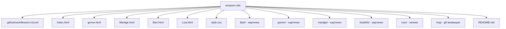

# Simpson Site — CI/CD на GitHub Pages
Индивидуальный проект: статический сайт про Симпсонов на HTML + CSS + JS с автоматическим деплоем на GitHub Pages через GitHub Actions.

## 🎯 Цель проекта

Научиться самостоятельно деплоить «живой» сайт на GitHub Pages через CI/CD, видеть историю деплоев в интерфейсе GitHub и открывать сайт по кликабельной ссылке.

## 🌐 Живой сайт

**Открыть:** [https://evgeny65ok.github.io/simpson-site/](https://evgeny65ok.github.io/simpson-site/)

## 📸 Скриншоты

### 1. Открытый сайт на GitHub Pages


### 2. GitHub Actions — успешные деплои


### 3. Настройки Pages (Source: GitHub Actions)


### 4. История деплоев (Deployments)


### 5. About с ссылками


## 📄 Страницы сайта

- 🏠 `index.html` — главная
- 🍩 `gomer.html` — Гомер Симпсон
- 👩 `Mardge.html` — Мардж Симпсон
- 🛹 `Bart.html` — Барт Симпсон
- 📚 `Liza.html` — Лиза Симпсон

## 🛠 Технологии

- **HTML5** — разметка страниц
- **CSS3** — стилизация, анимации, градиенты
- **JavaScript** — интерактив
- **GitHub Actions** — CI/CD
- **GitHub Pages** — хостинг

## 📁 Структура проекта



## 🔁 CI/CD

**Файл конфигурации:** `.github/workflows/ci-cd.yml`

### 🚀 Как обновить сайт

Внесите необходимые изменения в файлы проекта (HTML/CSS/JS), а затем выполните в терминале следующие команды:

```bash
git add .
git commit -m "Update"
git push origin main
```

> ⏱ Через **30 секунд** изменения автоматически появятся на «живом» сайте!

## 📊 История обновлений

| # | Коммит | Изменение |
| :--- | :--- | :--- |
| **1** | `Initial commit` | Первая версия сайта |
| **2** | `Update 1` | Изменён заголовок |
| **3** | `Update 2` | Изменён фон |
| **4** | `Update 3` | Изменён текст |

## 🔗 Полезные ссылки

- 🌐 [Живой сайт](https://evgeny65ok.github.io/simpson-site/)
- ⚙️ [GitHub Actions](https://github.com)
- 🚀 [Deployments](https://github.com)
- 📦 [Environments](https://github.com/github-pages)

## 👤 Автор

- **Evgeny65ok** — [GitHub Профиль](https://github.com)
